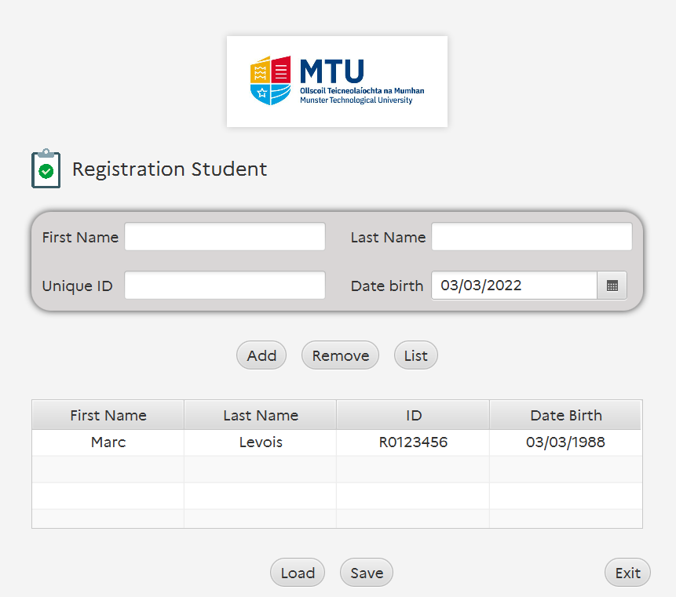

<h1 align="center"><br/>
  Student record
</h1>
<p align="center">Your best record app.</p>


# Project Title

An application that stores student records at the university.
The records consist of information about each student and information about the modules they have completed and the grades they received.



# Table of content

- [Project Title](#project-title)
- [Table of content](#table-of-content)
- [Quick download](#quick-download)
- [Features](#features)
- [License](#license)
- [Authors](#authors)

# Quick download
- To install the project, **clone** the repository, and in an empty directory, type the following command:

  ```https://git.unistra.fr/jvondermarck/student-record.git```

- Download the game <a href="https://git.unistra.fr/jvondermarck/student-record/-/blob/main/out/artifacts/Student_jar/Student.jar">here</a>, run, and here you go!

> If you have a problem running the `.jar` file, please follow the instructions to update Java [here](https://www.java.com/fr/download/)

## Compiling the project
- TODO

# Features
- TODO

# License
- TODO
# Authors

- Developped by : **Julien Von Der Marck**
