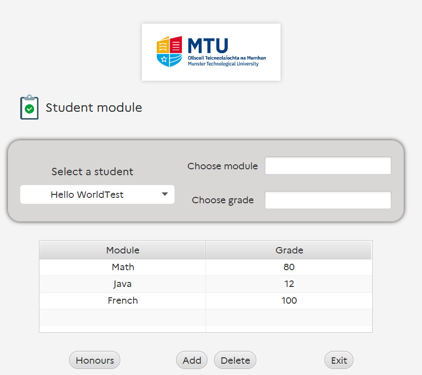
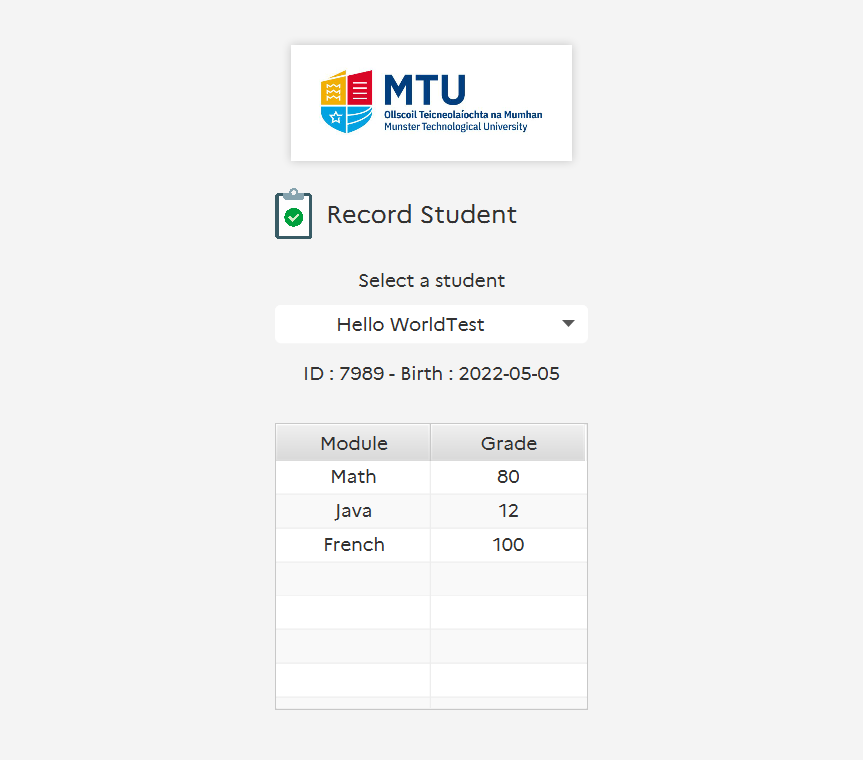

<h1 align="center"><br/>
  Student record
</h1>
<p align="center">Your best record app.</p>

# Project Title

An application that stores student records at the university.
The records consist of information about each student and information about the modules they have completed and the grades they received.


# Table of content

- [Project Title](#project-title)
- [Table of content](#table-of-content)
- [Quick download](#quick-download)
- [Features](#features)
- [License](#license)
- [Authors](#authors)

# Quick download
- To install the project, **clone** the repository, and in an empty directory, type the following command:

  ```https://git.unistra.fr/jvondermarck/student-record.git```

- Download the game <a href="https://git.unistra.fr/jvondermarck/student-record/-/blob/main/out/artifacts/Student_jar/Student.jar">here</a>, run, and here you go!

> If you have a problem running the `.jar` file, please follow the instructions to update Java [here](https://www.java.com/fr/download/)
> Don't forget to download [Derby](https://db.apache.org/derby/derby_downloads.html)

## Compiling the project

- In a terminal, type the following command `java -jar Student.jar`

Open the .JAR file in the same folder as the database path which sould be `database/MTUDATABASE`.

> If you don't have a JDK version greater than 15 it won't work 
> And don't forget to install Derby first

# Features

- Use of MVC
- [Java Doc](docs) created
- Use of JDBC Derby database
- Implementation of JPA (need to be finish)
- JUnit test cases
- Display error messages to the user if something is going wrong




# License
- Check the following licence [here](LICENSE)

# Authors

- Developped by : **Julien Von Der Marck**
